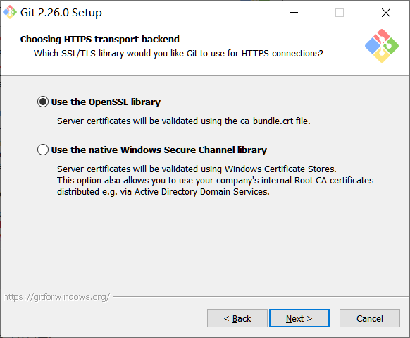
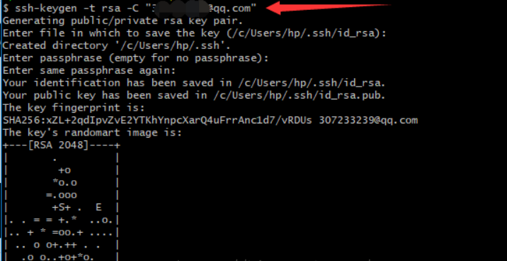

# git安装-公钥私钥ssh的步骤


## 1,git下载并开始安装

### git下载

```

下载地址:  https://git-scm.com/download/win; 
链接：https://pan.baidu.com/s/1ifxi48G08HcQRxRqsTAYvQ 
提取码：xeql
```

### git安装

#### 1,双击**.exe文件,点击next


#### 2,路径设置


3，点击安装, 然后下一步, 直到下面这个页面:建议如我的一样勾选


4，


5，点击next:

建议: 这个页面是选择git使用的命令行, 建议使用第一个git自带的;





6,点击下一步, 直到出现下面这个页面:

建议: 这个是选择行结束符, windows与linux行结束符不一致; 建议选择第一个, 这样git会自动转换;


7,点击下一步, 直到出现下面这个页面:

建议: 选择命名行窗口, 建议第一个;


8,点击下一步, 直到出现下面这个页面:

建议: 是否开启文件缓存, 选第一个; 点击install;


9,等待安装


10,安装成功后: 击桌面上的git快捷方式打开命名行, 运行git命名, 出现如下界面则成功:


  

至此，本地安装好git 


## 2,配置ssh,私钥公钥的步骤


### 1.如上面本地安装好git 

### 2.桌面右键 Git Bash Here 打开git命令行；


### 3.ssh-keygen -t rsa -C "XXX@xxx.com"   （全部按enter）；



### 4.cd ~/.ssh   && cat id_rsa.pub     在命令行打开这个文件，会直接输出密钥,复制,注意空格不要哦;


### 5.打开github   ，点自己头像 >> settings >> SSH and GPG keys >>New SSH key 


### 6.titile  随便写。  key里粘贴第4步的内容


至此.配置完成

## **注意:**

```
每台电脑与一个账号只需要一次哦

同时生成了一个公钥(.pub格式的那个就是)和一个私钥，把公钥放在git远程服务器上，在你操作时远程服务器的公钥与你本地的私钥配对获取权限
```


## 3,上传本地文件

### 1,建立本地仓库

在windows本地新建目录:

C:\Users\lpd\Documents\note\stepsKnowledge

### 2,创建一个本地文件

  (1)  将需要传入github云端的文件放入此文件夹

（2）执行指令进行初始化，会在原始文件夹中生成一个隐藏的文件夹.git：

```
   $  git init
```


（3）执行指令将文件添加到本地仓库：

    $ git add .         //添加当前文件夹下的所有文件

（4）输入本次的提交说明，准备提交暂存区中的更改的已跟踪文件，单引号内为说明内容：

    $ git commit -m "love"  //引号中的内容为对该文件的描述
### 3、关联github仓库

在github中新建一个repository，复制仓库地址：

```
如:https://github.com/jimodengzi/stepsKnowledge.git
```


执行命令：

```
   //新建一个repository时会出现下面的代码，直接复制即可

   $ git remote add origin https://github.com/jimodengzi/stepsKnowledge.git
```


注意：

如果出现错误：fatal: remote origin already exists，则执行以下语句：

    $ git remote rm origin

再重新执行：

```
 $ git remote add origin https://github.com/jimodengzi/stepsKnowledge.git
```


即可成功。

最后执行命令：

    $ git push origin master
如果出现错误failed to push som refs to…….，则执行以下语句，先把远程服务器github上面的文件拉先来，再push 上去。：

   $ git pull origin master


刷新github，即可看到上传的文件夹。
